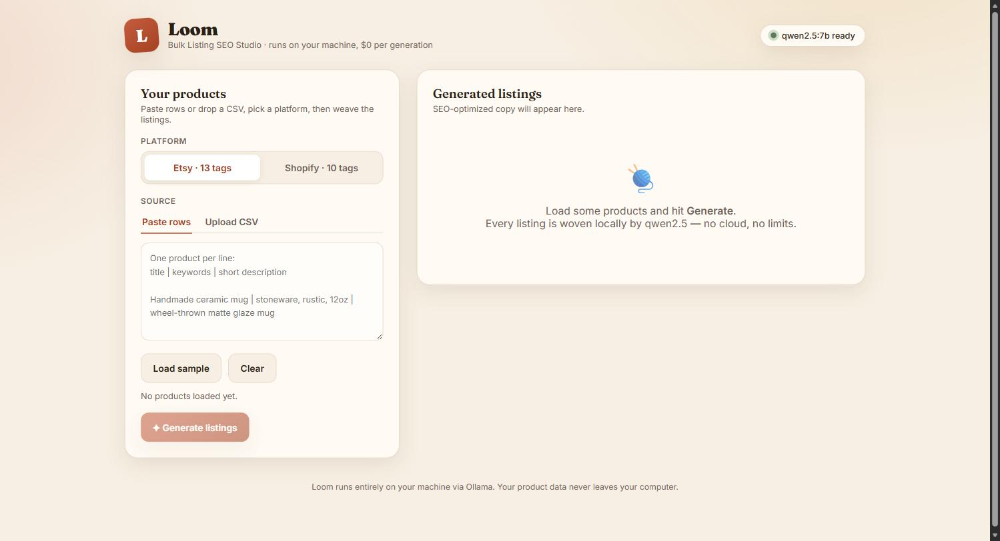
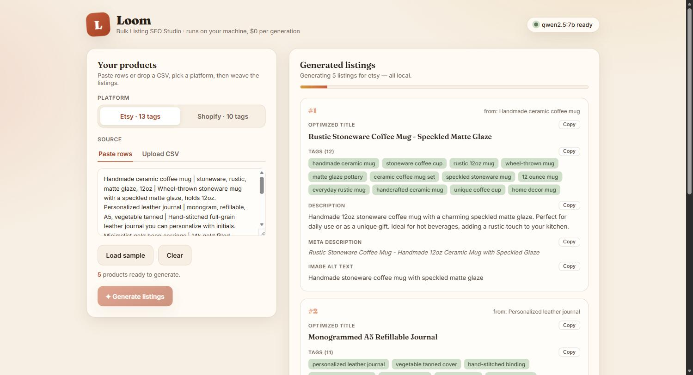
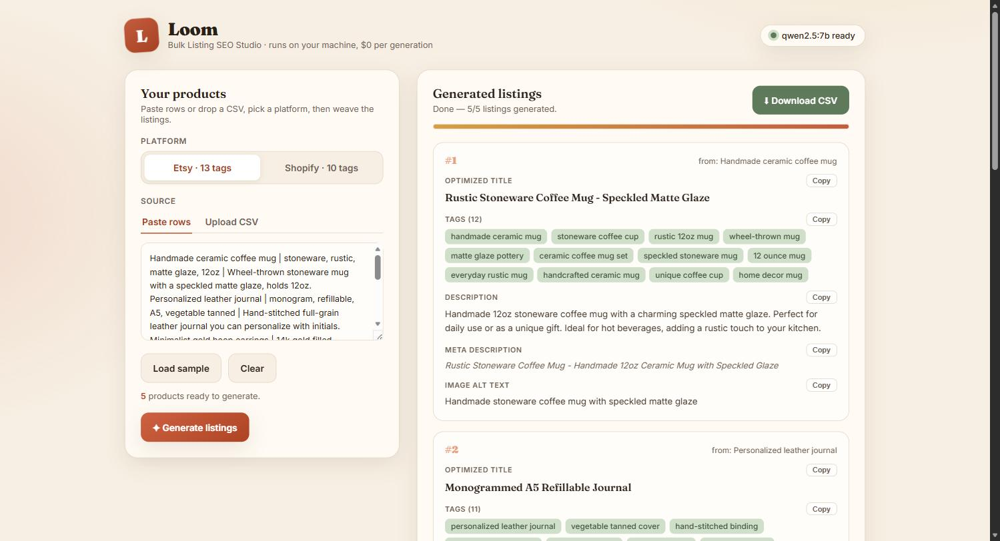

# 🧵 Loom — Bulk Listing SEO Generator

### Generate SEO-optimized Etsy and Shopify listing copy in bulk with a local LLM — unlimited generations, fully offline, $0 API cost.

### [▶️ Get it on Gumroad](#) &nbsp;`[Buy link — coming soon]`

  

---

## What it does

Loom turns a list of products into platform-ready listing copy — in bulk. Paste your products or upload a CSV, pick **Etsy** or **Shopify**, and Loom weaves an optimized title, platform-correct tags, a keyword-rich description, a meta description, and image alt text for **every product at once**. Then export the whole batch as a CSV ready to paste straight into your shop.

## Who it's for

Etsy and Shopify sellers with large catalogs who are tired of metered tools like Marmalead and eRank that charge a monthly subscription and cap how much you can generate. Loom is the opposite: unlimited generations, your product data never leaves your computer, and it works offline.

| | Loom | Metered cloud tools |
|---|---|---|
| Cost per generation | **$0** | Subscription / credits |
| Generation limit | **Unlimited** | Capped |
| Where data lives | **Your machine** | Their servers |
| Works offline | **Yes** | No |

## Features

- **Bulk generation** — every product in your list optimized in one run, with live progress.
- **Platform-aware output** — Etsy (titles up to 140 chars, up to 13 multi-word tags ≤20 chars) or Shopify (≤60-char page title, 10 collection/search tags) — the rules are baked in.
- **Five fields per product** — optimized title, tags, a 90–160 word benefit-led description, a ≤150-char meta description, and ≤125-char image alt text.
- **Flexible input** — paste `title | keywords | description` rows, or upload a CSV (headers and common aliases like `name`, `tags`, `desc` auto-detected). Or click *Load sample* to try it instantly.
- **One-click export** — copy any field, or download the full batch as a CSV ready for your shop.
- **100% local** — runs on Ollama on your machine; your catalog never leaves it.

## Screenshots

*The dashboard — pick a platform, add products by paste or CSV, and generate the whole batch.*

*Each row generated locally with live progress as Loom works through the batch.*

*Completed listings — copy any field with one click, or download the full batch as CSV.*

## How it works

A FastAPI server builds a platform-specific prompt for each product and calls the local Ollama API with JSON-formatted output, then normalises the result (tag cleanup, count caps) into a predictable shape. The dashboard is a single self-contained HTML file — no build step and no external JS dependencies. A small API (`/api/health`, `/api/sample`, `/api/generate`, `/api/upload`, `/api/export`) makes it scriptable too.

## Tech stack

`Python 3` · `FastAPI` · `Uvicorn` · local `Ollama` (`qwen2.5:7b`) · vanilla HTML/CSS/JS frontend (no framework, no build step)

---

## ▶️ Get Loom

`[Buy link — coming soon]` — a Gumroad listing for this tool isn't live yet.

*This is a showcase repository — it contains the product overview and screenshots only. The full source is available with your purchase.*

 

**Built by Hugo Kuznicki**

[🌐 Website](https://kuznickicapital-ship-it.github.io/personal-site/) · [📰 Newsletter](https://hugos-newsletter-e0c067.beehiiv.com/) · [𝕏 @Kuznickihugo](https://x.com/Kuznickihugo)

If my tools save you time, you can [💜 sponsor my work on GitHub](https://github.com/sponsors/kuznickicapital-ship-it).

